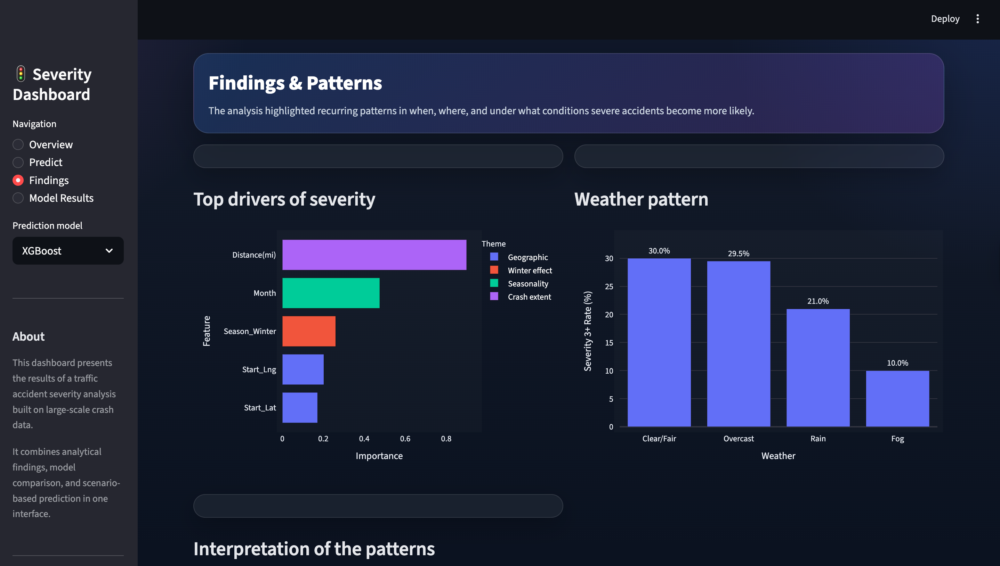
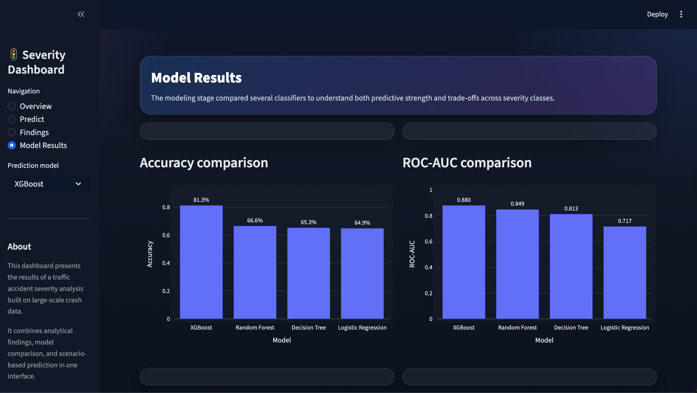
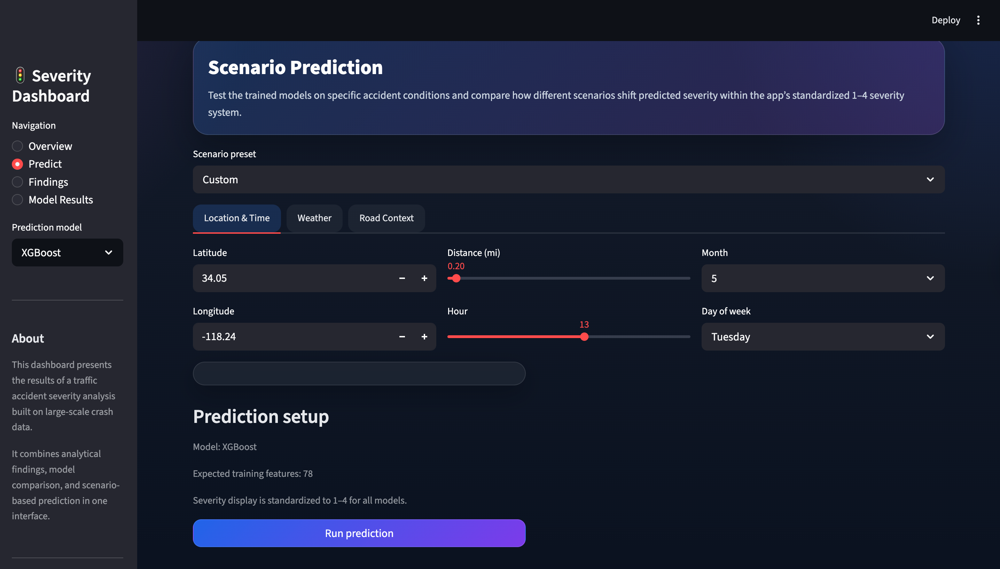

# Crash Severity Prediction 🚗

Machine learning system to predict traffic accident severity and understand operational disruption to roadway networks.

[](https://www.python.org/)
[](https://streamlit.io/)
[](LICENSE)

---

## 🎯 Project Overview

**Objective:** Predict accident severity to anticipate traffic disruption and inform incident management strategies  
**Dataset:** 445,073 US accidents (2016-2023) after cleaning 500K Kaggle sample  
**Best Model:** XGBoost - 81.3% accuracy, 0.880 ROC-AUC

This project analyzes traffic accident data to understand what conditions lead to more severe crashes and how severity can be predicted from real-time observable features. Accident severity directly affects traffic flow disruption, incident clearance time, emergency response requirements, and overall network performance.

### Key Discovery
**Severe accidents occur more frequently in clear weather than in fog** (30% vs 10% Severity 3+ rate). Drivers increase speed when visibility is good, leading to higher-impact crashes that cause greater roadway disruption and longer incident durations.

### Class Imbalance Note
The dataset is heavily imbalanced (77% Severity 2), reflecting real-world accident distributions. Models were evaluated using multiple metrics beyond accuracy to ensure meaningful performance across all severity levels, particularly for rare but operationally critical severe accidents.
**Smote was used to 

---

## 🚀 Quick Start

### Installation

```bash
# Clone repository
git clone https://github.com/emu-code/accident-severity-prediction.git
cd accident-severity-prediction

# Install dependencies
pip install -r requirements.txt

# Run Streamlit dashboard
streamlit run app.py
```

### 📊 Data Insights


### 🤖 Model Performance


### 🔮 Prediction Interface


### Requirements
- Python 3.8+
- streamlit >= 1.28.0
- pandas >= 1.5.0
- numpy >= 1.23.0
- scikit-learn >= 1.2.0
- xgboost >= 1.7.0
- plotly >= 5.14.0
- joblib >= 1.2.0
- shap>=0.51.0

---

## 📊 Results Summary

### Model Performance

| Model | Accuracy | F1-Macro | ROC-AUC | Operational Focus |
|-------|----------|----------|---------|-------------------|
| **XGBoost** | **81.3%** | 0.479 | 0.880 | General severity prediction |
| Random Forest | 66.6% | 0.428 | 0.849 | Better detection of rare severe cases |
| Decision Tree | 65.3% | 0.408 | 0.803 | Interpretable rules |
| Logistic Regression | 64.9% | 0.352 | 0.712 | Baseline comparison |

### Top 5 Severity Drivers (SHAP Analysis)

1. **Distance(mi)** - 0.90: Road impact extent (proxy for multi-vehicle involvement and lane blockage)
2. **Month** - 0.48: Seasonal patterns (winter shows highest severity)
3. **Season_Winter** - 0.26: Ice, snow, and reduced visibility effects
4. **Start_Lng** - 0.20: Geographic longitude (corridor-specific risk)
5. **Start_Lat** - 0.17: Geographic latitude (regional variation)

**Interpretation:** Severity is driven by crash extent (Distance), weather/seasonal conditions, and geographic context. These factors collectively determine the magnitude of traffic disruption, incident complexity, and clearance time requirements.

---

## 🚦 Traffic Operations Insights

### Severity and Traffic Disruption

Accident severity directly correlates with operational impact:

- **Severity 1 (Minor)**
- **Severity 2 (Moderate)** 
- **Severity 3 (Serious)** 
- **Severity 4 (Severe)** 
### Clear Weather Operational Challenge

The counter-intuitive finding that clear weather produces more severe accidents has important implications for traffic operations:

- Higher speeds in good visibility lead to higher-impact crashes
- Severe crashes in clear weather create unexpected disruptions during periods of otherwise smooth traffic flow
- Network operators may underestimate incident risk during favorable weather conditions

### Geographic Risk Concentration

Latitude and longitude features ranked in top 5 severity drivers, indicating persistent high-risk corridors. This suggests that:

- Certain roadway segments or geographic areas consistently experience more severe accidents
- Network vulnerability is geographically concentrated, not uniformly distributed
- Targeted monitoring and rapid response capabilities should prioritize these high-severity zones

### Infrastructure and Severity

Analysis found that 93% of Severity 4 accidents occur at locations lacking traffic signals. This reveals that:

- Uncontrolled intersections are disproportionately associated with severe crashes
- Traffic control infrastructure correlates with reduced crash severity
- High-risk unsignalized junctions represent critical vulnerability points in the network

---

## 🏗️ Project Structure

```
accident-severity-prediction/
│
├── app.py                          # Streamlit dashboard
├── requirements.txt                # Dependencies
├── README.md                       
├── project_summary.md             # Concise project report
│
├── models/                         # Trained models
│   ├── xgboost_tuned_model.pkl
│   ├── random_forest_model.pkl
│   ├── decision_tree_model.pkl
│   └── logistic_regression_model.pkl
│
├── data/                           
│   ├── raw/
│   ├── processed/
│   └── splits/
│
└── results/                        
    ├── metrics/
    └── visualizations/
```

---

## 🔬 Methodology

### Data Pipeline
1. **Cleaning** - 500K → 445K records (89% retention), removing critical missing data
2. **Feature Engineering** - Created 8 operational features (Rush_Hour, Season_Winter, High_Risk_Junction, etc.)
3. **Log Transformations** - Normalized skewed distributions (Distance, Visibility, Wind_Speed, Precipitation)
4. **Encoding** - One-hot encoding for categorical variables (Weather, Wind Direction, Season)
5. **Balancing** - SMOTE applied to training data to address class imbalance
6. **Evaluation** - Multi-metric assessment (Accuracy, F1-macro, ROC-AUC, per-class performance)

### Model Development
- Compared 4 classification algorithms
- Hyperparameter tuning via RandomizedSearchCV for XGBoost
- 80/20 stratified train-test split
- SHAP analysis for feature importance and interpretability

The trained model files are hosted externally because of repository size limits.

Download them here: [Google Drive Model Files](https://drive.google.com/drive/folders/1m-XvSilQJZx5Ol2Rfc6ekZrEBI-eqdKb?usp=sharing)

After downloading, place the files inside the `models/` folder, then run:

---

## 📱 Streamlit Dashboard

### Pages

**1. Overview**  
Project summary, key metrics, and main findings

**2. Predict**  
Real-time severity prediction using 4 models with scenario presets:
- Low-risk daytime urban
- Busy rush-hour conflict point
- High-risk winter highway
- Foggy unsignalized junction

**3. Findings**  
SHAP feature importance, clear weather paradox visualization, and pattern analysis

**4. Model Results**  
Model comparison charts and performance trade-off analysis

---

##  Key Findings

### 1. Clear Weather Paradox
Severe accidents are more common in clear weather than in fog (30% vs 10% Severity 3+ rate), suggesting that driver behavior (increased speed in good visibility) outweighs direct weather hazard.

### 2. Distance as Primary Severity Driver
Road impact extent (Distance) has the highest SHAP importance (0.90). Longer crash spread indicates multi-vehicle involvement, higher speeds, and more complex incident scenarios requiring extended clearance operations.

### 3. Model Selection Trade-off
- **XGBoost:** 81.3% accuracy, optimized for overall performance
- **Random Forest:** 66.6% accuracy, but 3.9× better at detecting rare Severity 4 cases

Choice depends on operational priority: general prediction accuracy vs. rare severe case detection.

### 4. Geographic Concentration
Location features (Lat/Lng) rank in top 5 drivers, indicating that certain corridors or regions consistently experience higher severity crashes.

### 5. Seasonal and Temporal Patterns
- Winter shows elevated severity due to ice, snow, and reduced visibility
- Rush hour affects accident **frequency** more than **severity**
- Time of day influences exposure but not crash seriousness

---

##  Testing the Dashboard

### Test 1: Severity Variation Across Scenarios

**High-Risk Scenario:**
- Distance: 3.8 mi, Weather: Snow, Month: January, Hour: 22 (night), No traffic signal
- **Expected:** Severity 3-4

**Low-Risk Scenario:**
- Distance: 0.2 mi, Weather: Clear, Month: May, Hour: 13 (afternoon), Traffic signal present
- **Expected:** Severity 1-2

 **Verify:** Predictions differ significantly between scenarios

### Test 2: Model Comparison

Switch between XGBoost, Random Forest, Decision Tree, and Logistic Regression using the same inputs.

---

##  Skills Demonstrated

- **Transportation Analysis:** Understanding operational implications of accident severity
- **Machine Learning:** Pipeline design, feature engineering, model selection, imbalanced data handling
- **Data Science:** Exploratory analysis, SHAP interpretation, hypothesis testing


---

## 📝 Dataset Citation

```bibtex
@misc{us_accidents_dataset,
  author = {Moosavi, Sobhan and Samavatian, Mohammad Hossein and Parthasarathy, Srinivasan and Ramnath, Rajiv},
  title = {A Countrywide Traffic Accident Dataset},
  year = {2019},
  publisher = {Kaggle},
  url = {https://www.kaggle.com/datasets/sobhanmoosavi/us-accidents}
}
```

**Note:** This project uses a 500K-record sample from the full 7.7M-record dataset.

---

## 👤 Author

**Emumena Oweh**  
📧 emuoweh@gmail.com  
🔗 [LinkedIn](https://www.linkedin.com/in/emumena-oweh-52296b172/)  
🐙 [GitHub](https://github.com/emu-code)

---

**GOMYCODE Data Science Capstone Project**  
**Focused on transportation operations and traffic incident analysis**

---

## 📚 Project Components

- **app.py** - Interactive Streamlit dashboard for severity prediction
- **project_summary.md** - Concise project report with methodology and findings
- **README.md** - Complete project documentation (this file)
- **models/** - Trained classification models
- **results/** - Performance metrics and visualizations

---
